# AeonStagery UI 视图与交互组件导航手册

> 本文件是 AeonStagery 前端 UI 的全景路由手册。用于在接收到界面修改、样式调整、交互优化等需求时，快速定位到具体组件、样式及关联状态。

---

## 1. 核心架构与多窗口表面 (Multi-Surface Architecture)

AeonStagery 采用多表面（Surface）渲染模式，通过 URL 参数 `?surface=` 由 [`src/main.tsx`](../src/main.tsx) 分发到不同的窗口入口：

| 表面标识 (`surface`) | 窗口定位 | 代码入口 | 职责与能力 |
| --- | --- | --- | --- |
| `editor`（默认） | **主编辑器窗口** | [`src/App.tsx`](../src/App.tsx) | 包含顶栏、舞台、播放控制器、右侧检查器/工作台工具、底部时间轴轨道及所有全局弹窗。 |
| `agent` | **项目智能体独立窗口** | [`src/AgentWindow.tsx`](../src/AgentWindow.tsx) | 包含独立对话流、工具调用日志、思考链、上下文消耗与场景读写交互。 |
| `workspace-tools` | **独立工作区工具窗口** | [`src/WorkspaceToolsWindow.tsx`](../src/WorkspaceToolsWindow.tsx) | 独立运行的工作区调试工具，包含实时参数监控、生肉脚本 Monaco 编辑器、角色列表。 |

---

## 2. 主编辑器界面布局拓扑 (Editor Layout)

主编辑器界面采用三段式经典工作台布局，配合悬浮覆盖层与模态弹窗系统：

```mermaid
flowchart TD
    App["src/App.tsx (app-container)"]
    
    App --> TopBar["顶栏 TopBar (top-bar)"]
    TopBar --> CollabPanel["协作状态面板 CollaborationConnectPanel"]
    TopBar --> MoreMenu["更多操作菜单 (主题/设置/更新日志)"]

    App --> MainContent["主工作区 (main-content)"]
    
    MainContent --> StageArea["舞台区 (stage-area)"]
    StageArea --> CanvasMount["Pixi 画布挂载 (canvasMountRef)"]
    CanvasMount --> StageOverlay["舞台交互叠加层 StageOverlay.tsx"]
    StageArea --> StageHUD["视口工具栏 HUD (stage-viewport-hud)"]
    StageArea --> Playback["播放控制条 PlaybackControls.tsx"]
    StageArea --> BakeOverlay["烘焙进度蒙层 BakeProgressOverlay.tsx"]
    
    MainContent --> LeftSidebar["轨道优先左栏 LeftSidebarPanel.tsx"]
    LeftSidebar --> CompactOutline["剧本大纲 / 角色管理"]
    MainContent --> SidePanel["右侧检查器 (side-panel)"]
    SidePanel --> InspectorEditor["LazyTimelineEditor (mode='inspector')"]
    InspectorEditor --> InspectorArea["InspectorArea.tsx"]
    InspectorArea --> FixedInspector["轨道优先 PropertyInspectorShell.tsx"]
    FixedInspector --> ActionDetail["固定属性 ActionInspector.tsx"]
    InspectorArea --> ActionsList["剧本动作优先 TimelineListView.tsx"]
    ActionsList --> QuickFields["基本属性 StatementQuickControls.tsx"]
    ActionsList --> InlineDetail["行内展开 ActionInspector.tsx"]
    ActionsList --> ViewPicker["视图选择器 InspectorViewPicker.tsx"]
    InspectorArea --> ToolViews["JSON / 运行快照 / 诊断"]

    App --> BottomPanel["底部时间轴 (bottom-panel)"]
    BottomPanel --> TrackEditor["LazyTimelineEditor (mode='tracks')"]
    TrackEditor --> TrackArea["TrackArea.tsx"]
    TrackArea --> Ruler["时间标尺 Ruler.tsx"]
    TrackArea --> Playhead["播放游标 Playhead.tsx"]
    TrackArea --> Tracks["多轨道与动作块 TrackComponents.tsx"]
    TrackArea --> ContextMenu["轨道右键菜单 BlockContextMenu / BlankContextMenu"]

    App --> StatusBar["底栏状态条 StatusBar.tsx"]
    
    App --> Modals["模态弹窗系统 (Modals & Overlays)"]
    Modals --> SettingsDialog["设置弹窗 SettingsDialog.tsx"]
    Modals --> AiWorkbench["AI 铺戏 AgentGeneratorPanel.tsx"]
    Modals --> VoiceWorkbench["语音工作台 VoiceWorkbench.tsx"]
    Modals --> ProjectHome["项目主页 ProjectHome.tsx"]
    Modals --> ExportDialog["导出弹窗 ExportDialog.tsx"]
```

---

## 3. 详细组件路由全景表

### 3.1 顶部栏 (TopBar)

* **主文件**: [`src/App.tsx`](../src/App.tsx) 中的 `.top-bar` 容器
* **全局样式**: [`src/index.css`](../src/index.css)

| 视觉区域 / 控件 | 职责描述 | 相关文件与组件 |
| --- | --- | --- |
| **标题与项目状态** | Logo、软件版本 Badge、当前打开项目名称 | [`src/App.tsx`](../src/App.tsx) |
| **快速操作按钮** | 保存场景 (`IconSave`)、切换/打开项目 (`IconFolder`) | [`src/App.tsx`](../src/App.tsx) |
| **校验指示器 (Validation Pill)** | 显示场景语法与校验错误/警告数量，点击定位问题 | [`src/App.tsx`](../src/App.tsx)、[`src/ui/store/ValidationStore.ts`](../src/ui/store/ValidationStore.ts) |
| **协作连接面板** | 房间连接状态指示器、在线用户头像列表、连接配置浮窗 | [`src/ui/CollaborationConnectPanel.tsx`](../src/ui/CollaborationConnectPanel.tsx) |
| **视图与构图辅助** | 构图九宫格/辅助线开关 (`IconTarget`) | [`src/App.tsx`](../src/App.tsx) (`gizmosVisible`) |
| **业务操作按钮** | WebGal 重新生成、AI 铺戏 (`IconAiProse`)、项目 Agent (`IconAgent`)、语音 (`IconVolume2`)、导出 (`IconFilm`)（模板包与能力配置已精简并统一收归至设置弹窗） | [`src/App.tsx`](../src/App.tsx) |
| **更多菜单** | 切换主题（浅色/深色，粉棕主题已退役）、打开更新日志、打开全局设置、重启应用 | [`src/App.tsx`](../src/App.tsx) 中的 `.top-bar__menu` |

---

### 3.2 舞台区与视口 HUD (Stage Area & HUD)

* **容器**: [`src/App.tsx`](../src/App.tsx) 中的 `.stage-area` 与 `.stage-container`
* **交互**: 支持鼠标拖拽平移视口、滚轮缩放

| 视觉区域 / 控件 | 职责描述 | 相关文件与组件 |
| --- | --- | --- |
| **Pixi 画面挂载** | 承载 Pixi 画布容器，响应矩阵平移缩放变换 | [`src/App.tsx`](../src/App.tsx) (`canvasMountRef`)、[`src/engine/Bootstrapper.ts`](../src/engine/Bootstrapper.ts) |
| **舞台操作叠加层** | 人物选择框、拖拽把手、对齐辅助指示、变换交互 | [`src/ui/StageOverlay.tsx`](../src/ui/StageOverlay.tsx) |
| **视口控制 HUD** | 缩放百分比胶囊、放大/缩小按钮、居中适配 (Fit)、视角回中、辅助线开关 | [`src/App.tsx`](../src/App.tsx) (`.stage-viewport-hud`) |
| **无场景占位** | 项目打开但未载入场景时的引导占位图与按钮 | [`src/App.tsx`](../src/App.tsx) (`.empty-state`) |
| **烘焙进度蒙层** | 复杂动作与离线计算时的全屏/半屏进度遮罩 | [`src/ui/BakeProgressOverlay.tsx`](../src/ui/BakeProgressOverlay.tsx) |

---

### 3.3 播放控制条 (Playback Controls)

* **文件**: [`src/ui/PlaybackControls.tsx`](../src/ui/PlaybackControls.tsx)
* **状态来源**: [`src/ui/store/PlaybackStore.ts`](../src/ui/store/PlaybackStore.ts)

| 视觉部件 | 职责描述 |
| --- | --- |
| **播放/暂停** | 控制主时间轴走针与动画引擎播放状态，支持空格快捷键 |
| **Seek 拖动进度条** | 视觉化进度条，支持 Hover 预览时间戳、拖动实时跳转播放针 |
| **步进跳转** | 上一帧 / 下一帧（单帧微调） |
| **时间码指示器** | 当前时间 / 总时长 (`00:00.00 / 00:00.00`) |
| **播放速率与音量** | 播放速度切换 (0.5x, 1x, 2x)、全局音量滑块与静音控制 |

---

### 3.4 底部时间轴与轨道 (Timeline Tracks)

* **主入口**: [`src/ui/TimelineEditor.tsx`](../src/ui/TimelineEditor.tsx) (`mode="tracks"`)
* **核心目录**: [`src/ui/timeline/`](../src/ui/timeline/)

| 视觉区域 / 功能 | 职责描述 | 对应文件 |
| --- | --- | --- |
| **时间标尺 (Ruler)** | 刻度绘制、吸附标记点、点击定位游标 | [`src/ui/timeline/Ruler.tsx`](../src/ui/timeline/Ruler.tsx) |
| **播放游标 (Playhead)** | 红色垂直指引线、游标头部把手拖动 | [`src/ui/timeline/Playhead.tsx`](../src/ui/timeline/Playhead.tsx)、[`src/ui/timeline/usePlayhead.ts`](../src/ui/timeline/usePlayhead.ts) |
| **轨道主工作区** | 多轨道布局、轨道分组折叠、轨道头与内容区对齐 | [`src/ui/timeline/TrackArea.tsx`](../src/ui/timeline/TrackArea.tsx) |
| **动作块 (Track Blocks)** | 动作条视觉渲染、块左右伸缩把手、拖拽移动、生命周期成对高亮 | [`src/ui/timeline/TrackComponents.tsx`](../src/ui/timeline/TrackComponents.tsx)、[`src/ui/timeline/useBlockDrag.ts`](../src/ui/timeline/useBlockDrag.ts)、[`src/ui/timeline/useBlockResize.ts`](../src/ui/timeline/useBlockResize.ts) |
| **多选与框选** | 鼠标框选多块、多选条操作（统一移动、删除、成组） | [`src/ui/timeline/MarqueeOverlay.tsx`](../src/ui/timeline/MarqueeOverlay.tsx)、[`src/ui/timeline/TimelineSelectionBar.tsx`](../src/ui/timeline/TimelineSelectionBar.tsx) |
| **缓动曲线叠加 (Easing)** | 动作块间的过渡动画曲线预览与预设选择 | [`src/ui/timeline/EasingOverlay.tsx`](../src/ui/timeline/EasingOverlay.tsx)、[`src/ui/timeline/curvePresets.ts`](../src/ui/timeline/curvePresets.ts) |
| **标记点 (Markers)** | 场景书签、节拍标记弹窗 | [`src/ui/timeline/MarkerPrompt.tsx`](../src/ui/timeline/MarkerPrompt.tsx)、[`src/ui/timeline/useMarkerManager.ts`](../src/ui/timeline/useMarkerManager.ts) |
| **右键上下文菜单** | 动作块右键菜单（复制/分割/删除/转换）、空白处右键菜单（新增动作） | [`src/ui/timeline/BlockContextMenu.tsx`](../src/ui/timeline/BlockContextMenu.tsx)、[`src/ui/timeline/BlankContextMenu.tsx`](../src/ui/timeline/BlankContextMenu.tsx) |
| **缩放与视口定位** | 时间轴水平缩放滑块、重置缩放 | [`src/ui/timeline/TimelineZoomSlider.tsx`](../src/ui/timeline/TimelineZoomSlider.tsx)、[`src/ui/timeline/timelineViewport.ts`](../src/ui/timeline/timelineViewport.ts) |
| **自定义 Live2D 动作编辑** | 动作关键帧时间轴、曲线图表与参数调整 | [`src/ui/timeline/CustomMotionEditor.tsx`](../src/ui/timeline/CustomMotionEditor.tsx)、[`src/ui/timeline/CustomMotionConversionDialog.tsx`](../src/ui/timeline/CustomMotionConversionDialog.tsx) |

---

### 3.5 右侧属性与动作检查器 (Inspector Area)

* **主入口**: [`src/ui/TimelineEditor.tsx`](../src/ui/TimelineEditor.tsx) (`mode="inspector"`)
* **核心容器**: [`src/ui/timeline/InspectorArea.tsx`](../src/ui/timeline/InspectorArea.tsx)
* **样式文件**: [`src/ui/timeline/Inspector.css`](../src/ui/timeline/Inspector.css)

两种布局的入口由 `InspectorArea` 分流：轨道优先使用 `LeftSidebarPanel` 的剧本/角色双 Tab 和右侧固定 `PropertyInspectorShell`，左侧大纲以紧凑单行展示语句，不混入对白与动作摘要，底部轨道占满全宽；未选中语句时右栏显示空态。剧本动作优先仅使用右侧 `TimelineListView`，`StatementQuickControls` 在折叠行中使用 `InlineNumericInput` 等软件控件编辑语句源参数，完整 `ActionInspector` 以 `presentation="inline"` 在语句下展开，但不再渲染 `.selected-action-header`——标题、时间、播放与删除已由语句行承担，展开区只剩属性表单与协作提醒。JSON、运行快照和诊断视图替换右栏内容；选择和展开语句不改变舞台区域的尺寸。

两种布局的语句列表均由 [`useVirtualTimelineRows`](../src/ui/timeline/useVirtualTimelineRows.tsx) 测量行高并按视口挂载，保留正在编辑的焦点行；内联检查器复用列表的 semantic read model。快捷文本控件复用 `FormComponents` 的远端感知草稿，失焦提交、Escape 取消，避免逐字符重建场景。左栏拖拽由 `useResizableLayout` 管理，宽度在拖拽结束时持久化。

| 视觉区域 / 视图 | 职责描述 | 对应文件 |
| --- | --- | --- |
| **视图选择器** | 顶部 Tab 切换（剧本动作 / 工作区调试工具） | [`src/ui/timeline/InspectorViewPicker.tsx`](../src/ui/timeline/InspectorViewPicker.tsx) |
| **剧本时间轴大纲** | 当前场景动作的树状/列表大纲视图，支持拖拽重排与快速查找 | [`src/ui/timeline/TimelineListView.tsx`](../src/ui/timeline/TimelineListView.tsx)、[`src/ui/SequentialFlowPanel.tsx`](../src/ui/SequentialFlowPanel.tsx) |
| **语句块库 (Block Library)** | 可拖拽/点击添加到时间轴的预设动作块库（最近使用条目上限降为 6 条；希区柯克变焦与角色接地语句块已退役） | [`src/ui/StatementBlockLibrary.tsx`](../src/ui/StatementBlockLibrary.tsx)、[`src/ui/timeline/StatementLibraryMenu.tsx`](../src/ui/timeline/StatementLibraryMenu.tsx) |
| **动作属性表单 (Action Inspector)** | 当前选中动作的各项参数编辑（对白、立绘、镜头、转场、音效等） | [`src/ui/timeline/ActionInspector.tsx`](../src/ui/timeline/ActionInspector.tsx)、[`src/ui/timeline/ActionInspectorTabs.tsx`](../src/ui/timeline/ActionInspectorTabs.tsx) |
| **目标与角色绑定选择器** | 角色选择、镜头通道选择、光照与特效目标下拉 | [`src/ui/timeline/TargetPicker.tsx`](../src/ui/timeline/TargetPicker.tsx)、[`src/ui/timeline/LightingTargetPicker.tsx`](../src/ui/timeline/LightingTargetPicker.tsx) |
| **Live2D 参数展示** | 选中角色的动作库、表情库、物理参数映射表单 | [`src/ui/timeline/live2dParameterPresentation.ts`](../src/ui/timeline/live2dParameterPresentation.ts)、[`src/ui/timeline/characterPerformancePresentation.ts`](../src/ui/timeline/characterPerformancePresentation.ts) |
| **角色目录与管理** | 角色进出场、层级排序、外观预设配置 | [`src/ui/timeline/CharacterDirectoryPanel.tsx`](../src/ui/timeline/CharacterDirectoryPanel.tsx)、[`src/ui/timeline/CharacterIntegrationControls.tsx`](../src/ui/timeline/CharacterIntegrationControls.tsx) |
| **上下文面板** | 场景元数据、全局演出节奏、环境变量配置 | [`src/ui/timeline/ContextPanel.tsx`](../src/ui/timeline/ContextPanel.tsx) |

---

### 3.6 核心模态弹窗与浮层 (Modals & Overlays)

| 弹窗名称 | 唤起途径 | 核心组件 | 关联子组件 / 样式 |
| --- | --- | --- | --- |
| **全局设置 (Settings)** | 顶栏更多菜单 / 快捷键 `Ctrl+,` / 事件 `ui:openSettings` | [`src/ui/SettingsDialog.tsx`](../src/ui/SettingsDialog.tsx) | 包含通用外观、快捷键设置、以及「项目模板」(`templates`) 页签（管理模板包启用、优先级、默认样式覆盖、角色导入、模板 ZIP 包直接导入与 AI 表演画像配置）：[`src/ui/shortcuts/ShortcutSettingsPanel.tsx`](../src/ui/shortcuts/ShortcutSettingsPanel.tsx)、[`src/ui/templates/TemplateProjectConfigDialog.tsx`](../src/ui/templates/TemplateProjectConfigDialog.tsx)、[`src/ui/templates/TemplatePerformanceProfileEditor.tsx`](../src/ui/templates/TemplatePerformanceProfileEditor.tsx)、[`src/ui/settingsNavigation.ts`](../src/ui/settingsNavigation.ts) |
| **AI 创作工作台 (AI Prose)** | 顶栏「AI 铺戏」按钮 | [`src/ui/AiProseWorkbench.tsx`](../src/ui/AiProseWorkbench.tsx)、[`src/ui/AgentGeneratorPanel.tsx`](../src/ui/AgentGeneratorPanel.tsx) | [`src/ui/FormalSceneEnhancementPanel.tsx`](../src/ui/FormalSceneEnhancementPanel.tsx)、[`src/ui/AiScriptSegmentPanel.tsx`](../src/ui/AiScriptSegmentPanel.tsx)、[`src/ui/AiProseTrace.tsx`](../src/ui/AiProseTrace.tsx)、[`src/ui/ai-prose-workbench.css`](../src/ui/ai-prose-workbench.css) |
| **语音工作台 (Voice Workbench)** | 顶栏「语音」按钮 | [`src/ui/voice/VoiceWorkbench.tsx`](../src/ui/voice/VoiceWorkbench.tsx) | 与 GPT-SoVITS 语音服务对接，管理角色声音预设 |
| **软件更新 (Software Updates)** | 全局设置 → 关于 | [`src/ui/settings/UpdateSettingsPanel.tsx`](../src/ui/settings/UpdateSettingsPanel.tsx) | OSS / GitHub 增量下载渠道选择、检查、下载与重启安装；GitHub 缺少块图时尝试从 OSS 补取，更新策略见 [ADR-0036](adr/0036-update-channels-and-differential-baselines.md) |
| **项目主页与新手引导** | 首次启动或关闭项目后全屏呈现 | [`src/ui/onboarding/ProjectHome.tsx`](../src/ui/onboarding/ProjectHome.tsx) | 欢迎页、最近项目、模板 ZIP 导入（`onImportTemplate`）、[`src/ui/onboarding/FirstLessonController.tsx`](../src/ui/onboarding/FirstLessonController.tsx)、[`src/ui/onboarding/SetupWizard.tsx`](../src/ui/onboarding/SetupWizard.tsx)、[`src/ui/onboarding/SpotlightOverlay.tsx`](../src/ui/onboarding/SpotlightOverlay.tsx) |
| **视频导出对话框** | 顶栏「导出」按钮 | [`src/ui/ExportDialog.tsx`](../src/ui/ExportDialog.tsx) | 场景渲染为视频的分辨率、码率与编码进度 |
| **资源库与文件选择** | 各种动作选择图片/音频/模型时 | [`src/ui/AssetBrowserModal.tsx`](../src/ui/AssetBrowserModal.tsx) | [`src/ui/ResourceFileBrowser.tsx`](../src/ui/ResourceFileBrowser.tsx)、[`src/ui/ResourcePanel.tsx`](../src/ui/ResourcePanel.tsx) |
| **WebGal 重生成** | 顶栏「重新生成」按钮 | [`src/ui/WebGalRegenerateDialog.tsx`](../src/ui/WebGalRegenerateDialog.tsx) | WebGal 单文件场景重新解析确认 |
| **场景迁移确认** | 打开旧版本场景（如 v3/v4 自动迁移至 Scene v5）时触发 | [`src/ui/SceneMigrationConfirmationDialog.tsx`](../src/ui/SceneMigrationConfirmationDialog.tsx) | [`src/ui/hooks/useSceneMigrationDialog.ts`](../src/ui/hooks/useSceneMigrationDialog.ts) |
| **更新日志与公告** | 顶栏「公告」按钮 / 更多菜单 | [`src/ui/changelog/ChangelogDialog.tsx`](../src/ui/changelog/ChangelogDialog.tsx) | [`src/ui/changelog/changelog.css`](../src/ui/changelog/changelog.css) |
| **崩溃恢复界面** | 渲染进程出现未捕获异常时全屏激活 | [`src/ui/CrashScreen.tsx`](../src/ui/CrashScreen.tsx) | [`src/ui/GlobalErrorBoundary.tsx`](../src/ui/GlobalErrorBoundary.tsx)、[`src/ui/ErrorBoundary.tsx`](../src/ui/ErrorBoundary.tsx) |

---

### 3.7 通用表单与基础组件 (Common Controls)

* 统一存放在 [`src/ui/`](../src/ui/) 根目录：
  * **下拉框与带搜索选择器**: [`src/ui/FormSelect.tsx`](../src/ui/FormSelect.tsx)、[`src/ui/SearchableSelect.tsx`](../src/ui/SearchableSelect.tsx)
  * **颜色选择器**: [`src/ui/ColorPickerInput.tsx`](../src/ui/ColorPickerInput.tsx)
  * **行内文件选取器**: [`src/ui/InlineFilePicker.tsx`](../src/ui/InlineFilePicker.tsx)
  * **浮动气泡提示**: [`src/ui/Tooltip.tsx`](../src/ui/Tooltip.tsx)、[`src/ui/tooltip.css`](../src/ui/tooltip.css)
  * **轻量全局吐司**: [`src/ui/Toast.tsx`](../src/ui/Toast.tsx) (`showToast(message, type)`)
  * **SVG 图标库**: [`src/ui/icons.tsx`](../src/ui/icons.tsx)（所有内置矢量图标集中定义处）
  * **Markdown 渲染**: [`src/ui/MarkdownContent.tsx`](../src/ui/MarkdownContent.tsx)
  * **Monaco 编辑器绑定**: [`src/ui/monaco/monacoRuntime.ts`](../src/ui/monaco/monacoRuntime.ts)

---

## 4. UI 状态管理与数据流

AeonStagery 的 UI 状态分为四层：

1. **服务容器与核心上下文**:
   * [`src/ui/context/AppContext.tsx`](../src/ui/context/AppContext.tsx)：提供全局 `contextValue.services`（文件访问、场景工作流、音视频服务等）以及统一的 `timelineAdapter`（提供 `select()`, `commitStatement()`, `removeStatement()` 等核心编辑方法）。
2. **细粒度响应式 Store**:
   * [`src/ui/store/storeHooks.ts`](../src/ui/store/storeHooks.ts)：组件消费状态的主入口（如 `useSemanticDocument()` 消费当前 `SceneDocumentV5` 场景文档，`useSelectedActionCount()`, `useEditorState()`, `useValidationIssues()`）。
   * [`src/ui/store/PlaybackStore.ts`](../src/ui/store/PlaybackStore.ts)：播放时间戳、播放状态、速度。
   * [`src/ui/store/ValidationStore.ts`](../src/ui/store/ValidationStore.ts)：语法与语义校验问题列表。
   * [`src/ui/SettingsStore.ts`](../src/ui/SettingsStore.ts)：用户持久化偏好设置与外部资源挂载点。
3. **全局事件总线**:
   * [`src/api/events.ts`](../src/api/events.ts) (`eventBus`)：用于解耦的跨模块通信（如 `ui:openSettings`, `engine:seek:report` 等）。
4. **布局与视口交互 Hooks**:
   * [`src/ui/hooks/useViewport.ts`](../src/ui/hooks/useViewport.ts)：舞台缩放与平移变换。
   * [`src/ui/hooks/useResizableLayout.ts`](../src/ui/hooks/useResizableLayout.ts)：侧边栏宽度、底部时间轴高度拖拽调节。
   * [`src/ui/hooks/useKeyboardShortcuts.ts`](../src/ui/hooks/useKeyboardShortcuts.ts)：全局键盘快捷键分发。

---
